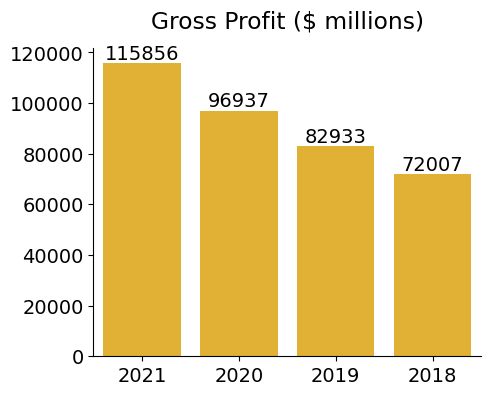
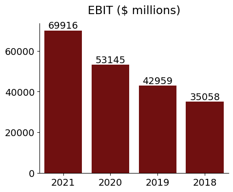

<!-- LaTeX preamble-->
\graphicspath{ {./rif-logos/} }

<!-- R setup libraries, using python (html_document)-->
```{r setup, include=FALSE, echo=FALSE}
library(reticulate)
library(knitr)
library(kableExtra)
library(xtable)
use_python("/usr/bin/python3")
```
<!-- Python imports -->
```{python, echo=FALSE}
# Imports
import finviz as fv
import yfinance as yf
import matplotlib.pyplot as plt
import pandas as pd
import seaborn as sns
from datetime import date
```

<!-- Table -->
```{python, echo=FALSE}
TICKER = 'MSFT'
stock_info = fv.get_stock(TICKER)

mkt_profile = {
  'Price':float(stock_info['Price']),
  'Beta':float(stock_info['Beta']),
  'Market Cap':str(stock_info['Market Cap']),
  'P/E':float(stock_info['P/E']),
  'P/B':float(stock_info['P/B']),
  'EPS (ttm)':float(stock_info['EPS (ttm)']),
  'ROE':str(stock_info['ROE']),
  'ROI':str(stock_info['ROI'])}

# Reticulate variables
PRICE = mkt_profile['Price']
BETA = mkt_profile['Beta']
MARKET_CAP = mkt_profile['Market Cap']
P_E = mkt_profile['P/E']
P_B = mkt_profile['P/B']
EPS = mkt_profile['EPS (ttm)']
ROE = str(mkt_profile['ROE'])
ROI = str(mkt_profile['ROI'])

# Remove % sign (Latex doesn't like compiling these for some reason)
ROE = ROE[:-1]
ROI = ROI[:-1]
mkt = pd.DataFrame.from_dict(mkt_profile, orient='index', columns=[''])

```

<!-- Charts -->
```{python, echo=FALSE, message=FALSE, results='hide'}

### Definitions ###
plt.rcParams.update({'font.size': 14})
plt.xticks(rotation=25)

def price_chart(ticker):
  stock = yf.Ticker(ticker)
  hist = stock.history(period='6mo', interval='1d')
  df = pd.DataFrame(data=hist, columns=['Close'])
  df.reset_index(inplace=True)
  
  # Plot
  plt.plot(df['Date'], df['Close'], color='#800000')
  plt.title(f'{ticker} Price History')
  plt.savefig('./rif-logos/price-chart.png', bbox_inches='tight')
  
# Generic barplot
def bar_plots(df, x, y, color, title, file_name):
  sns.barplot(data=df, x=x, y=y, color=color)
  plt.title(title)
  plt.savefig(file_name, bbox_inches='tight')

### Run ###

TICKER = 'MSFT'
stock = yf.Ticker(TICKER)
fin = stock.financials
financial_data = pd.DataFrame(data=fin)

print(stock.info)
summary = stock.info['longBusinessSummary']
# Date x-axis data
curr_year = int(date.today().year) 
dt = ['{}-05'.format(curr_year), '{}-05'.format(curr_year-1), '{}-05'.format(curr_year-2), '{}-05'.format(curr_year-3)]
# Financials
gross = [financial_data.loc['Gross Profit'][i]/1000000 for i in range(4)]
ebit = [financial_data.loc['Ebit'][i]/1000000 for i in range(4)]

# Save charts
price_chart(TICKER)
bar_plots(financial_data, dt, gross, '#FEBD18', 'Gross Profit ($ millions)', './rif-logos/gross-profit.png')
bar_plots(financial_data, dt, ebit, '#FEBD18', 'EBIT ($ millions)', './rif-logos/ebit.png')
```

<!-- Start of Document -->

<!-- Logo 
\vspace{5cm}
\begin{figure}[h!]
  \centering
  \includegraphics[width=16cm, height=24cm]{RIF-Logo-(MaroonTransparentBackground).png}
\end{figure}
-->
\vspace{-0.5cm}

\begin{figure}[h]
  \centering
  \includegraphics[width=8cm, height=3cm]{RIF-Logo-(MaroonTransparentBackground).png}
\end{figure}

\vspace{-0.75cm}

\section*{Market Profile}
\vspace{-0.25cm}
\begin{table}[h] 
  \label{tab:table1} 
  \begin{tabular}{p{5cm}p{12cm}}
      \hline
      \multicolumn{2}{c}{`r py$TICKER` Profile} \\
      \hline
      Price & `r py$PRICE` \\
      Beta & `r py$BETA` \\
      Market Cap & `r py$MARKET_CAP` \\
      P/E & `r py$P_E` \\
      P/B & `r py$P_B` \\ 
      EPS ttm & `r py$EPS` \\
      ROE  & `r py$ROE`\% \\
      ROI & `r py$ROI`\% \\
      \hline
  \end{tabular}
\end{table}
\vspace{-0.75cm}
\section*{Stock Chart}
\vspace{-0.5cm}
\begin{figure}[h!]
  \centering
  \includegraphics[width=\linewidth, height=11cm]{"./rif-logos/price-chart.png"}
  \label{fig:price-chart}
\end{figure}

\section*{Company Summary}
`r py$summary`

\section*{Financials}

\begin{figure}
\centering
\begin{minipage}{.5\textwidth}
  \centering
  \includegraphics[width=\linewidth]{"./rif-logos/gross-profit.png"}
  \label{fig:gp}
\end{minipage}%
\begin{minipage}{.5\textwidth}
  \centering
  \includegraphics[width=\linewidth]{"./rif-logos/ebit.png"}
  \label{fig:ebit}
\end{minipage}
\end{figure}

<!--
\begin{figure}[h]
\includegraphics[width=\textwidth]{"./rif-logos/financials.png"}
\label{fig:matrix}
\end{figure}
-->
<!--
\section*{Gross Profits}
```{r, echo=FALSE}

```

\section*{EBIT}
```{r, echo=FALSE}

```
-->